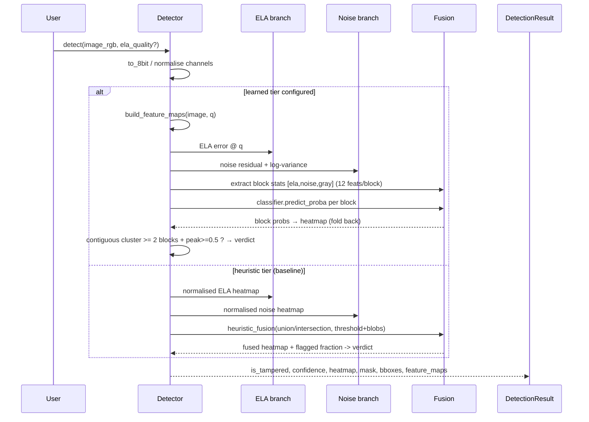
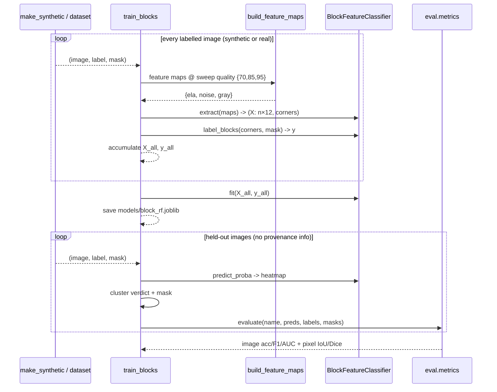

# IFD: Architecture

**Image Forgery Detector**: ELA + Noise-Fingerprint forensics in Python.

This document is the single entry point to understand the project. It covers
the conceptual pipeline, the codebase layout, the runtime flow, and the
evaluation methodology. After reading it you should be able to trace a single
image from input pixels to a verdict + localization mask, and to extend the
system with new features or a richer classifier.

---

## 1. Why it works (two independent signals)

A genuine photo has **one uniform compression/sensor-noise history**.
A tampered photo contains regions with a **mismatched history**. We measure
two orthogonal fingerprints of that history:

| Branch        | Signal being measured                        | Target manipulation          |
|---------------|----------------------------------------------|------------------------------|
| **ELA**       | JPEG re-compression loss per 8×8 block.     | Splicing / re-save artifacts |
| **Noise**     | Local pixel-noise variance (denoise residual). | Spliced / synthetic patches |

Each branch alone is heuristic and has well-known false-positive modes.
The **fusion** step combines them, and the **learned tier** replaces a
hand-tuned threshold with a classifier so the system generalizes.

```
 suspect image
      │
      ▼
┌─────────────┐   re-save at {70,85,95},     ┌──────────────┐
│ ELA branch  │── amp(abs difference) ─────▶│ ELA map      │──┐
└─────────────┘                              └──────────────┘  │
                                                            ▼
┌─────────────┐   denoise → residual →        ┌──────────────┐  ┌────────────┐
│ Noise branch│── local variance (32×32) ───▶│ noise map    │─▶│  FUSION    │──▶ verdict
└─────────────┘                              └──────────────┘  └────────────┘
                                                               │  + heatmap
                                                               ▼
                                                         localization mask
```

---

## 2. High-level architecture

```
                       ┌──────────────────────────────────────────┐
                       │                ifd package               │
                       │                                          │
  image_in ───────────▶│ ┌────────────────────────────────────────┐│
                       │ │ Detector (ifd/detector.py)            ││
                       │ │   detect(image) -> DetectionResult    ││
                       │ │   choose tier: heuristic | learned    ││
                       │ └───────────┬────────────┬──────────────┘│
                       │             │            │               │
                       │             ▼            ▼               │
                       │  ┌─────────────────┐  ┌─────────────────┐│
                       │  │ features/       │  │ features/noise  ││
                       │  │   ela.py        │  │   .py           ││
                       │  │   ELF maps      │  │   residual maps ││
                       │  └─────────────────┘  └─────────────────┘│
                       │             │            │               │
                       │             └──────┬─────┘               │
                       │                    ▼                     │
                       │           ┌───────────────┐              │
                       │           │ fusion/       │              │
                       │           │  heuristic    │              │
                       │           │  block clf    │              │
                       │           └───────┬───────┘              │
                       │                   │                      │
                       │                   ▼                      │
                       │           ┌───────────────┐              │
                       │           │ eval/metrics  │◀── labels    │
                       │           └───────────────┘              │
                       └──────────────────────────────────────────┘
                              │
                              ▼
              verdict + heatmap + mask + metrics

  optional stretch track:
    features/prnu.py  ─  camera reference fingerprint (Dresden), block correlation
```

### Module map (file → responsibility)

| File | Responsibility |
|---|---|
| `ifd/detector.py` | `Detector` orchestrates both branches, picks fusion tier, builds `DetectionResult`. `build_feature_maps()` is the **shared canonical feature extractor** used by training and inference. |
| `ifd/features/ela.py` | JPEG re-compress at a quality, amplified abs-diff, quality sweep stacking, grayscale heatmap. |
| `ifd/features/noise.py` | Wavelet (PyWavelets) or bilateral denoising, noise residual, local-variance map, heatmap. |
| `ifd/features/prnu.py` | **(stretch)** Reference fingerprint from N known-authentic images; per-block normalized correlation. Lukas-Fridrich-Goljan style. |
| `ifd/fusion/__init__.py` | `heuristic_fusion` (threshold+blobs), `BlockFeatureClassifier` (RandomForest over block stats), `threshold_components`, `normalize_heat`, `DetectionResult`. |
| `ifd/eval/metrics.py` | Image-level (acc/prec/recall/F1/ROC-AUC) + pixel-level (IoU/Dice/F1) via `evaluate()`. |
| `ifd/data/` | CASIA v1/v2 + Columbia loaders, image/mask pairing by filename convention, known-broken-file skip list. |
| `scripts/make_synthetic.py` | Synthetic splicing generator with **real mixed compression history** (the classic ELA scenario). |
| `scripts/train_blocks.py` | Trains `BlockFeatureClassifier` on synthetic or real data, saves a model, prints a held-out report. |
| `scripts/demo.py` | CLI: single-image HTML report or dataset-wide evaluation. `--model` loads a trained classifier. |
| `scripts/smoke_test.py` | End-to-end auto-verified smoke test (train → detect → evaluate → assert verdicts/localization). |

---

## 3. Sequence: single-image detection



### What happens inside the heuristic tier

1. Both maps are normalised to [0,1] by percentile clipping (`normalize_heat`).
2. Each map is thresholded; only **connected components ≥ `min_area` px** survive (`threshold_components`).
3. Union (either branch flags a pixel) or intersection both-branch mode → `fused_bin`.
4. `is_tampered = fused_bin.mean() >= suspect_fraction` (default 1%).
5. `confidence` blends how much area was flagged and how strongly (mean heat inside flags).

### What happens inside the learned tier

1. `build_feature_maps` → `ela` (mean per-channel error, float), `noise` (log1p of local variance), `gray`.
2. Sliding 64×64 blocks, 4 stats × 3 maps = 12 features per block.
3. `RandomForestClassifier.predict_proba` → per-block tamper probability.
4. Probabilities are folded back onto the block grid → full-size heatmap.
5. **Verdict**: threshold the heatmap at 0.5, keep connected components of at least
   **two blocks** in size; tampered iff such a cluster exists and peak proba ≥ 0.5.
   (Spurious single texture blocks, the classic FP mode, are dropped.)
6. The report heatmap also blends the two heuristic branches back in
   (0.5·ela + 0.25·noise + clf).

---

## 4. Sequence: training the learned fusion tier



Training uses a **random ELA quality per image** from the sweep {70, 85, 95}.
This teaches the classifier to work without knowing the suspect's provenance
(the analyst's real-world condition). Inference always runs at the default
quality, mirroring that.

---

## 5. Why the synthetic generator matters

`scripts/make_synthetic.py` does **not** just paste pixels. For ELA to fire, the
spliced region must have a *different compression history*:

1. parent photo → JPEG encode at `qh` (host history)
2. donor photo → JPEG encode at `qp ≪ qh` (patch history, heavy loss)
3. paste patch into host, re-encode the composite at `qh`

After this, the host region is a JPEG **fixpoint** at `qh` (re-saving at `qh`
changes ~nothing), while the patch region still carries `qp`-era quantization
loss and **lights up** at re-save `qh`. Authentic images are the host encoded
once and never touched.

Without this recipe (e.g. splicing raw arrays and encoding the whole thing
once) every region shares one history and the ELA signal vanishes, reproducing
the documented real-world limitation in miniature.

---

## 6. Evaluation harness

`ifd/eval/metrics.py` computes, then reports **per dataset**:

* **Image-level**: accuracy, precision, recall, F1, ROC-AUC
  (`ImageMetrics`, `EvalReport.roc_auc`).
* **Pixel-level** (only where ground-truth masks exist): IoU, Dice, pixel
  F1/precision/recall (`PixelMetrics`).

`evaluate(name, predictions, labels, masks)` returns an `EvalReport` whose
`summary()` prints both blocks. The harness is dataset-agnostic, which enables
the CASIA-v2 vs CASIA-v1 (out-of-distribution) comparison the spec calls for.

---

## 7. Data loaders

* `CasiaDataset(root)`: indexes `Au_*` (authentic) / `Tp_*` + `Sp_*` (tampered)
  files, pairs tampered images with `_gt.png` masks using the community naming
  convention (`github.com/namtpham/casia2groundtruth`), and skips files on the
  known-broken list (`IML-Dataset-Corrections`: 17 masked-resolution-mismatch
  CASIA v2 images + 1 CASIA v1 image with no mask). Tampered images whose mask
  is missing are indexed with `mask_path=None`; downstream code treats that
  as "no mask available", never an error.
* `ColumbiaDataset(root)`: marker-based scan for `au_*` / `sp_*` pairs.

Both are **lazy** (paths indexed up front; pixels decoded on demand).

---

## 8. Extension points

| You want to…                        | Touch this |
|-------------------------------------|------------|
| Swap the denoiser                   | `features/noise.py: denoise_wavelet` / `noise_residual(denoiser=...)` |
| Add ELA qualities to the sweep      | `DetectorConfig.ela_qualities` / `features/ela.py: DEFAULT_QUALITIES` |
| Swap RandomForest → SVM/LogReg      | `fusion/BlockFeatureClassifier.model` |
| Swap classifier → small CNN         | Keep `build_feature_maps` output as the 3-channel input; fold block labels the same way as the RandomForest tier. |
| Feature ablation                    | `detect()`: drop the `noise` or `ela` map from the fused heatmap, re-run harness. |
| Add SIFT/ORB copy-move track        | New feature module + register map key in `build_feature_maps`. |
| Full PRNU with Dresden              | `features/prnu.py`: feed ≥20-50 authentic shots per camera → `compute_photo_response_non_uniformity`. |

Reference PRNU math can be validated against `polimi-ispl/prnu-python`.

---

## 9. Known limitations (by design, not accident)

1. **Heuristic tier is a brittle baseline.** Threshold + blob detection flags
   high-contrast edges and text (ELA FP mode) and textured regions (noise FP
   mode). On synthetic data it scores ~0.5 accuracy → the learned tier exists
   to beat it; report both numbers.
2. **Copy-move (same-sensor) forgeries** defeat the noise branch by
   construction; ELA only helps if the moved patch has different compression
   history. Keypoint matching (SIFT/ORB) is the right tool there.
3. **Matching-quality recompression** washes out ELA. Anti-forensics (matching
   quality, added noise, GAN inpainting) defeats both classical signals;
   the field has moved toward learned fingerprints (Noiseprint, ManTraNet).
4. **Single-image provenance unknown** → only *blind* noise-consistency is
   possible; reference PRNU requires multiple known-authentic images per camera
   (Dresden), which CASIA does not provide.
5. **Synthetic data ≠ real data.** Published-grade numbers (85-92% on CASIA)
   require real datasets; the harness reports per-dataset so you can see out-of
   -distribution drop-off instead of one aggregate number. The shipped
   `models/block_rf.joblib` is trained on a synthetic+real mix (synthetic
   mixed-history pairs *plus* real authentic photos, `--authentic-root`), which
   fixes the "real photo → tampered" behaviour of the synthetic-only model.
   Residual risk: dense real texture (e.g. foliage) can still form a cluster
   that trips the ≥2-block rule (one of the two probe photos below).
6. **Real CASIA v2 is wired but not yet won.** `--dataset-root` feeds real
   tampered data into training (masks auto-paired at ~97% via the
   `CASIA 2 Groundtruth` layout, `_gtN` name variants handled, `_spaced`
   sampling so the split covers all manipulation classes, `--keep-synthetic`
   to mix pairs in). Measured on 113 held-out CASIA v2 images, the 12-feature
   RandomForest reaches only ~0.74 AUC and ~20% recall at the 0.5 cluster
   threshold, and training on that content re-flags the clean probe photos.
   The limiting factor is tier capacity, not data availability; closing the
   gap needs richer features (e.g. ELA across the whole quality sweep) or a
   learned fingerprint.